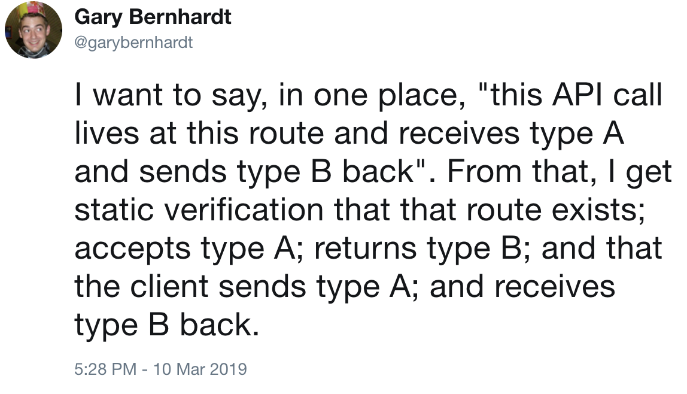

# Full-stack type safety

## with `TypeScript` and `io-ts`

[Milano TS 10/04/2019](https://www.meetup.com/it-IT/MilanoTS/events/260048808/)

---


###### twitter.com/giogonzo
###### twitter.com/Milano_TS
###### buildo.io

---


twitter.com/garybernhardt/status/1104882486809509888

---


# destroyallsoftware.com/talks/wat

---



---

# Goals

##### “Full-stack” typesafety

&nbsp;&nbsp;&nbsp;&nbsp;In other words, having a single source of truth for the API description that allows to validate client code against server changes at build time (or the other way around).

##### API validation “for free”

&nbsp;&nbsp;&nbsp;&nbsp;Once we have our source of truth, we'd like to exploit it and avoid to write custom validations of API inputs.

##### Write less code manually

&nbsp;&nbsp;&nbsp;&nbsp;Other than validation, how much boilerplate code can we delegate to our solution? E.g. client code generation.

##### If possible, avoid codegen

&nbsp;&nbsp;&nbsp;&nbsp;Can we avoid an additional build step?

---

# Available Solutions

## GraphQL

```sh
apollo client:codegen [options]
```

```sh
graphql-codegen
```

## Swagger, gRPC, ...

## Custom

`Scala` -> `TypeScript`

```sh
metarpheus > metarpheus-io-ts
```

github.com/buildo/metarpheus

---

# Full-stack TS: opportunities

## No impedance mismatch

Same power to express concepts at both ends.

_(still, data has to be (en/de)coded to/from the underlying representation, e.g. HTTP/JSON)_

## No need for codegen

You can reuse the same source code.

_(some care needed in webpack.config/tsconfig)_

## It's possible to share arbitrary code

Validation, business logic,... Unlike e.g. between `Scala` and `TS`

---

# Issues with the initial solution

Repo: github.com/giogonzo/fullstack-ts-http-api

```sh
git checkout step-0
```

no validation of input (`any` hides this at a first glance)

```ts
app.get('/getPostById', (req, res) => {
  // req.query is just `any`: we can
  // do what we want with it
  const postId = req.query.id
  // our postId is `any` in turn,
  // meaning it is assignable to anything
  postService.getById(postId).then(
    post => res.status(200).send(post)
  )
})
```

---

# Meet `io-ts`: github.com/gcanti/io-ts

1. Define "codecs" in the io-ts DSL (values)

```ts
import * as t from 'io-ts'

const User = t.type({ name: t.string, age: t.number })
```

2. Values are used at runtime for validations

```ts
User.decode({ name: 'gio', age: 30 }).fold(
  errors => {},
  user => {}
)
```

3. Static types can be derived with the type-level operator `TypeOf`

```ts
type User = t.TypeOf<typeof User>
// same as type User = { name: string, age: number }
```

---

# `decode` vs. `encode`

```
-----(client)-----        ---------(API)--------------

request: encode --> JSON --> decode --> process request
```

Note that `decode` can fail

```ts
t.string.decode(1).fold(
  (errors: ValidationErrors) => {},
  (s: string) => {}
)
```

... but `encode` never fails: given an `A` we always know how to obtain an `O`

```ts
t.string.encode('2') // '2'
```

---

# "Full-stack" type-safety

```sh
git checkout step-1
```

We obtained a nice property: if the API changes input or output types for the get post API call, `TS` will complain in our client build.

Suppose we added an additional `publishedOnly: boolean` filter the the API. In our client code:

```ts
fetchPostById({ id: 'foo' })
// TS will complain with "missing 'publishedOnly' key"
```

Moving on:

```sh
git checkout step-2
```

---

# Still missing some symmetry


We already had an implicit `encode()` for `Date`: `toString()`,
but we forgot to `decode()` client-side.

```
-----(client)------        ---------(API)--------------

request:  encode --> JSON --> decode --> process request
response: decode <-- JSON <-- encode <-- send response
```
---

# Meet `Type<A, O>`

Codecs are more than just “validators”, they can also transform values with `encode`/`decode`

A codec of type `Type<A, O>`

- represents the static type `A` at runtime
- can encode `A` into `O`
- can decode `unknown` into `A`, or fail with validation errors

We need something that is a `Type<Date, string>`

- represents the static type `Date` at runtime
- can encode `Date` into `string`
- can decode `unknwon` into `Date`, or fail with validation errors

---

# `io-ts-types`

We could write our own codec using `new t.Type()` or pick one already defined in `io-ts-types`.

```sh
git checkout step-3
```

```ts
import {
  DateFromISOString
} from 'io-ts-types/lib/Date/DateFromISOString'

export const GetPostByIdOutput = t.type({
  title: t.string,
  body: t.string,
  date: DateFromISOString
})
```

---

# DRY things up

```sh
git checkout step-4
```

Having added a second API call... our implementations (both API and client) are exactly the same, given:

- an `Input` codec
- an `Output` codec
- a `path: string` to provide to `express`

Generalising sort of makes sense given the various simplifications in our example, e.g.:
- all of our calls can be `GET` with a `query`

---

# DSL design

Given this representation for our API calls:

```ts
interface APICallDefinition<IA, IO, OA, OO> {
  path: string
  input: Type<IA, IO>
  output: Type<OA, OO>
}
```

We need a way to:
1. define API calls
2. implement them server-side
3. add an implemented API call to express
4. derivate the corresponding client call

Let's recap some useful TS features first.

---

# Type parameters

They make the description of the program more precise

```ts
const identity1 = (x: number): number => x;
[1, 2].map(identity1);
// Type 'string' is not assignable to type 'number'.
['a', 'b'].map(identity1);

const identity2 = (x: unknown): unknown => x;
// (parameter) x: unknown
['a', 'b'].map(identity2).map(x => {});

const identity = <A>(x: A): A => x;
// (parameter) x: string
['a', 'b'].map(identity).map(x => {});
```

typescriptlang.org/docs/handbook/generics.html

---

# Type parameters

They allow to add constraints to function signatures

```ts
function prop<
  O,
  K extends keyof O
>(obj: O, prop: K): O[K] {
  return obj[prop]
}

prop({ foo: 'foo', bar: 'bar' }, 'baz')
// Argument of type '"baz"' is not assignable to
// parameter of type '"foo" | "bar"'
```

typescriptlang.org/docs/handbook/generics.html

---

# A possible solution

```sh
git checkout step-5
```

1. helper to define an API call

```ts
// api/src/lib.ts

function defineAPICall<IA, IO, OA, OO>(
  config: APICallDefinition<IA, IO, OA, OO>
): APICallDefinition<IA, IO, OA, OO>
```

Example usage:

```ts
export const getPostById = defineAPICall({
  path: '/getPostById',
  input: GetPostByIdInput,
  output: GetPostByIdOutput
})
```

---

# A possible solution

2. helper to implement an API call server-side

```ts
function implementAPICall<IA, IO, OA, OO>(
  apiCall: APICallDefinition<IA, IO, OA, OO>,
  implementation: (input: IA) => Promise<OA>
): APICall<IA, IO, OA, OO>
```

Example usage:

```ts
const getPostById = implementAPICall(
  definitions.getPostById,
  input => service.getById(input.id)
)
```

---

# A possible solution

3. helper to add an implemented API call to `express`

```ts
// api/src/lib.ts

function addToExpress<IA, IO, OA, OO>(
  app: Application,
  apiCall: APICall<IA, IO, OA, OO>
): void
```

Example usage:

```ts
import * as apiCalls from './implementations'

addToExpress(app, apiCalls.getPostById)
```

---

# A possible solution

4. helper to derive the corresponding client call

```ts
// web/src/lib.ts

function makeAPICall<IA, IO, OA, OO>(
  apiEndpoint: string,
  apiCall: APICallDefinition<IA, IO, OA, OO>
): (input: IA) => Promise<OA>
```

Example usage:

```ts
import * as implementations from '../api/src/implementations'

const getPostById = makeAPICall(
  'localhost:3000',
  implementations.getPostById
)

getPostById({ id: '2' }).then(post => {})
```

---


twitter.com/garybernhardt/status/1107738508288876544

---

# What next?

We could add...

- support for more HTTP methods with different semantics
- support other common cases, e.g. `Authorization: Bearer ${token}`
- **error handling**
- **remove `path` from DSL**

---

# Takeaways

Simple & custom, but it works in production ™️

## Problems

- Our solution works only if we control the project full-stack
- If there's a need to support more verbs, headers etc. it can get quickly out of hands

## Real world

- No full-stack TS glue that I know of?
- API-side: `hyper-ts` + `io-ts` + `fp-ts-router`?

## Links

- this repo: github.com/giogonzo/fullstack-ts-http-api

---

# Error handling

We have ignored the fact that our service implementation can fail.

Let's see how to add simple error handling to `getPostById`.

#### Step 1: update the service signature and let TS guide us through the required changes.

```sh
git checkout step-7
```

---

# Let TS guide us through the required changes (1)

API implementation is not coherent with the definition:

```ts
export const getPostById = implementAPICall(
  definitions.getPostById,
  // Type 'Promise<Option<Post>>' is not
  // assignable to type 'Promise<Post>'.
  input => service.getById(input.id)
)
```

We have to update the definition accordingly, and serialize the `Option` to the client.
This is easy and once again we use an `io-ts` combinator from `io-ts-types`.

```sh
git checkout step-8
```

---

# Let TS guide us through the required changes (2)

The client implementation is not coherent with the definition:

```ts
// Type 'Option<Post>' is not
// assignable to type 'Post'.
renderPost(post)
```

We need the ability to handle the possible API failure.
Let's update our render method using `Option.fold`.

Final solution:

```sh
git checkout step-9
```

---

# Remove `path` from DSL

For each API call definition, we are providing an arbitrary `path: string` to match the `HTTP` request.

With the current DSL we can define and re-use API calls one by one, but we can't operate on the complete set of calls all at once.

All of this is fine, but one may think at the DSL differently, to operate on records instead:

```ts
addAllToExpress(app, implementations)
```
```ts
const API = makeAPI(definitions)
```

Let's recap some useful TS features first.

---

# Indexing at type-level

```sts
type User = {
  name: string
  age: number
}
const user: User = { name: 'gio', age: 30 }

type UserAge = User['age'] // number
const userAge: UserAge = user['age'] // 30
```

More than just object string properties:

```ts
type Posts = Array<Post>

type PostTitle = Posts[number]['title'] // string
```

---

# Mapped types

Define types by enumerating on properties

```ts
type Record<K extends PropertyKey, A> = { [k in K]: A }
```

Various use cases, e.g.

### Transform each property of a type in the same way

```ts
type Box<T> = {
  [K in keyof T]: { value: T[K] }
}
```

### Add or remove properties from a type

```ts
type Pick<T, K extends keyof T> = { [k in K]: T[k] }
```

typescriptlang.org/docs/handbook/advanced-types.html

---

# Conditional Types

www.typescriptlang.org/docs/handbook/advanced-types.html

```ts
T extends U ? X : Y
```

```ts
type APICallInputType<C> =
  C extends APICall<infer I, any, any, any>
    ? I
    : never
```

Final solution:

```sh
git checkout step-9
```